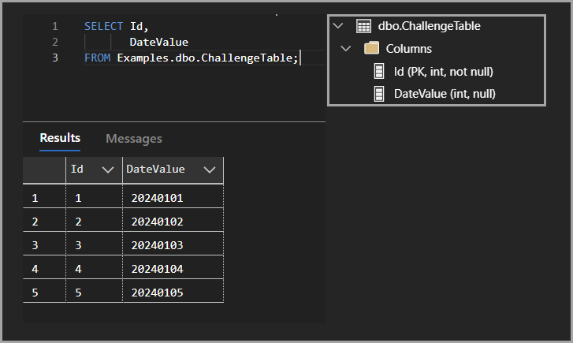
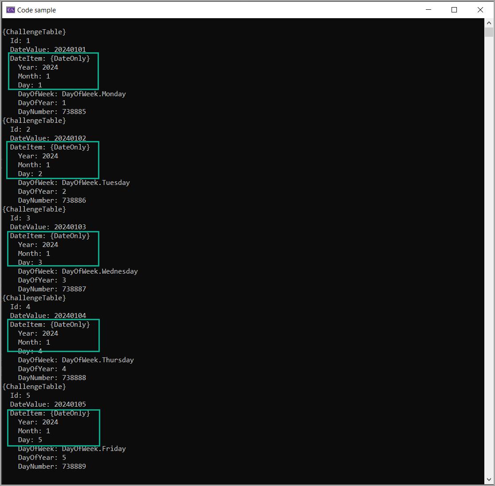

# SQL-Server Challange of the day

Given the following

Write a SELECT statement to produce the following. All code is there except for the conversions.

:stop_sign: Read instructions in Scripts\populate.sql

