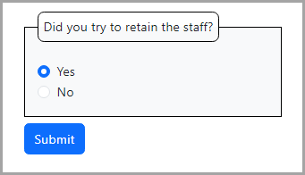

# About

Simple example of using radio buttons to ask a yes/no question without scripting. User choice shown in console window using SeriLog. If no choice, decide on what to do e.g. reprompt or accept no as the default response.

:heavy_check_mark: For those who want more than strings, we can do enum and/or a model and set the default.

